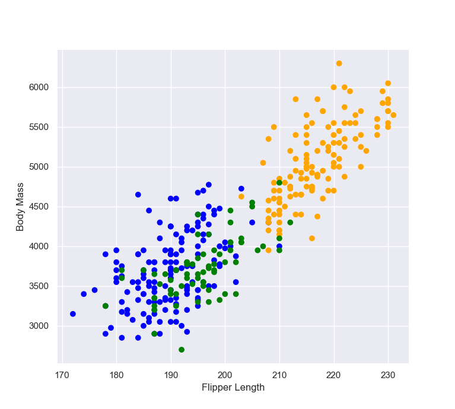
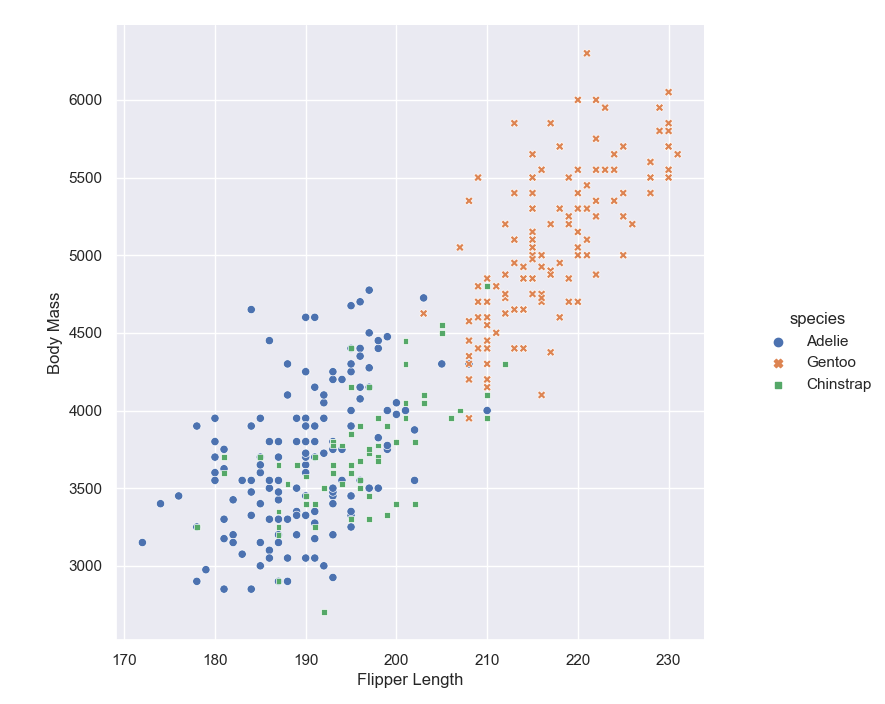

# Visualize

<!--https://juliescholler.gitlab.io/files/M2/M2-CM2-workflow2.html#3-->

## Data


The Palmer penguins dataset was introduced by Allison Horst, Alison Hill, and Kristen Gorman provide a great dataset for data exploration and  visualization, as an alternative to iris. It was first introduced as an R package.  The released version of palmerpenguins can be instaalled from CRAN with:

**R Installation**
`install.packages("palmerpenguins")`

Using [`palmerpenguins` python package](https://pypi.org/project/palmerpenguins/) you can easily load the Palmer penguins into your python environment.

**Python Installation**
`pip install palmerpenguins`

The palmerpenguins package contains two datasets : `penguins` and `penguins_raw`. `penguins` is a simplified version of the `penguins_raw` data.


## R

### `base` R package

```{r warning=FALSE, message=FALSE}
# Load Palmer Archipelago (Antarctica) Penguin Data
library(palmerpenguins)
# Return the first part of the dataset
head(penguins)
# Retrieve column names
colnames(penguins)

# Define color for each of the 3 iris species
colors <- c("#00AFBB", "#E7B800", "#FC4E07")
colors <- colors[as.numeric(penguins$species)]

# Define shapes
shapes = c(16, 17, 18) 
shapes <- shapes[as.numeric(penguins$species)]

plot(x = penguins$flipper_length_mm,
          y = penguins$body_mass_g,
          col = colors,
          pch = shapes,
          xlab = "Flipper Length",
          ylab = "Body Mass" )

```

### `gggplot2` Package

`ggplot2` is an R package dedicated to data visualization which  is based on The Grammar of Graphics [@wilkinson2012grammar]. 


```{r warning=FALSE, message=FALSE}
#load ggplot2 package to make statistical graphics
library(ggplot2)
library(palmerpenguins)
p <- ggplot(penguins) +
  geom_point( aes(x = flipper_length_mm,
                  y = body_mass_g,
                  color = species,
                  shape = species)) +
  xlab("Flipper Length")+
  ylab("Body Mass")

print(p)
```


## Python

<!--python code for the plot https://github.com/mcnakhaee/palmerpenguins-->


### `Matplotlib` package

Matplotlib is mainly deployed for basic plotting. Visualization using Matplotlib generally consists of bars, pies, lines, scatter plots and so on. 

```{python eval=FALSE}
#load functions in palmerpenguins package
from palmerpenguins import load_penguins
penguins = load_penguins()
# Return the first part of the dataset
penguins.head()
# Retrieve column names
list(penguins.columns)

# Import matplotlib to make statistical graphics. 
# By convention, it is imported with the shorthand sns.
import matplotlib.pyplot as plt

colors = {'Adelie':'blue', 'Gentoo':'orange', 'Chinstrap':'green'}
plt.scatter(penguins.flipper_length_mm, penguins.body_mass_g, c= penguins.species.apply(lambda x: colors[x]))
plt.xlabel('Flipper Length')
plt.ylabel('Body Mass')
```


```{r   out.width = "90%", echo = FALSE, fig.align='center'}

```


### `seaborn` Package

Seaborn provides a variety of visualization patterns. It uses fewer syntax and has easily interesting default themes.

```{python eval=FALSE}
# Import seaborn to make statistical graphics. 
# By convention, it is imported with the shorthand sns.
import seaborn as sns 
#load functions in palmerpenguins package
from palmerpenguins import load_penguins
penguins = load_penguins()

# Apply the default theme
sns.set_theme()
# sns.set_style('whitegrid')
p = sns.relplot(x = 'flipper_length_mm',
            y ='body_mass_g',
            hue = 'species',
            style = 'species',
            data = penguins)
p.set_xlabels('Flipper Length')
p.set_ylabels('Body Mass')           
```

```{r   out.width = "90%", echo = FALSE, fig.align='center'}

```

The function `relplot()` is named that way because it is designed to visualize many different statistical relationships. The `relplot()` function has a convenient kind parameter that lets you easily switch to this alternate representation:
`scatterplot()` with `kind="scatter"`; the default and `lineplot()` with `kind="line"`. 


### `plotnine` package 


https://pypi.org/project/plotnine/

plotnine is an implementation of a grammar of graphics in Python, it is based on ggplot2. The grammar allows users to compose plots by explicitly mapping data to the visual objects that make up the plot.

Plotting with a grammar is powerful, it makes custom (and otherwise complex) plots are easy to think about and then create, while the simple plots remain simple.
